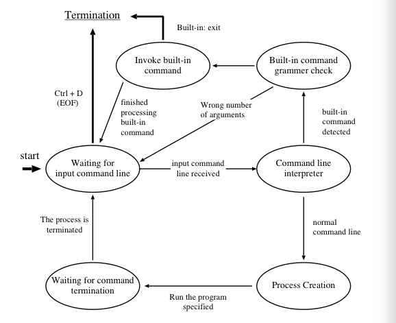
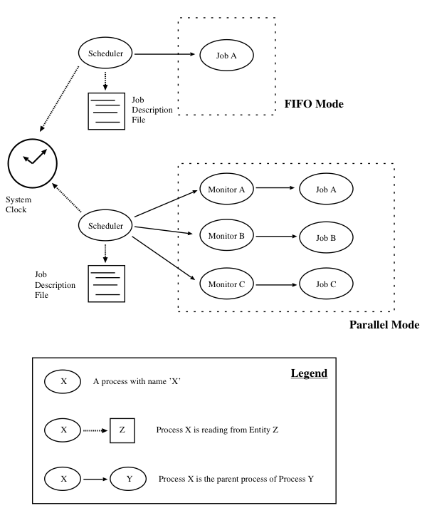

## Introduction

This repository is for homework-assignment with two deliverables implemented with **fork** and **execvp** system calls

1. a simple shell which accepts command lines with multiple command line arguments
2. a simple scheduler which accepts command lines and launch processes in parallel or in a FIFO manner

## Description

1. **Simple Shell**
	
	
	
2. **Scheduler**

	
	

## Reference

CSCI3150 Introduction to Operating System

Specification at `/CUHK/2015-2016 Term 1-2/CSCI3150 Introduction to Operating System/process.pdf`

